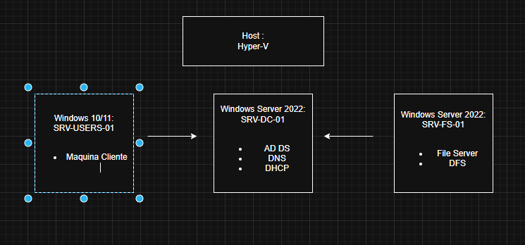

# 🖥️ Implementação de Infraestrutura Híbrida e Segura

### 🎯 Objetivo do Projeto
***"Simular um ambiente de médio porte para demonstrar habilidades em administração de servidores, automação com PowerShell e aplicação do princípio de privilégio mínimo (Least Privilege)."***

---

### 🛠️ Tecnologias Utilizadas

* Virtualização: Hyper-V / VMware vSphere.

* Sistemas: Windows Server 2022 & Windows 10/11.

* Serviços: AD DS, DNS, DHCP, Group Policy (GPO).

* Automação: PowerShell.

---

### 🚀 Etapas do Laboratório

* Fase 1 — Infraestrutura Base
 Criação das VMs no Hyper-V (Servidor + Cliente)
 Configuração de redes virtuais: interna e externa (NAT)
 IP estático no servidor
 Escopo DHCP configurado e validado
 
* Fase 2 — Ambiente Workgroup
 Criação de usuários e grupos locais
 Permissões NTFS diferenciadas por grupo em pastas compartilhadas
 Mapeamento de unidade de rede no cliente (net use)
 Validação de acesso por perfil de usuário

* Fase 3 — Active Directory & Domínio
 Instalação da role AD DS
 Promoção do servidor a Domain Controller
 DNS integrado ao domínio configurado automaticamente
 Criação de Unidades Organizacionais (OUs): TI, RH, Financeiro, Laboratórios
 Criação e gestão de usuários e grupos no domínio
 Ingresso da máquina cliente Windows 11 no domínio
 Login com credenciais de domínio validado

* Fase 4 — Group Policy Objects (GPOs)
 Criação da GPO — gerenciamento centralizado de configurações de usuários e computadores dentro do Active Directory
 Políticas de segurança e padronização — restrições no Windows, controle de acesso, limite tamanho de arquivo, bloqueio de tipo de arquivo
 Compartilhamento de software — Implementação de distribuição centralizada de softwares via GPO em ambiente de domínio.


---

### 🗺️ Arquitetura do Ambiente

***A topologia abaixo descreve a segmentação lógica de Unidades Organizacionais (OUs) e a conectividade entre o Controlador de Domínio e as Estações de Trabalho.***



---

### 💻 Scripts em Destaque

| Script | Função | Caminho |
| :--- | :--- | :--- |
| **Password Reset** | Automatiza o reset de senha com expiração forçada. | [`/scripts/passwordChange`](scripts/passwordChange) |
| **Bulk Import** | Criação de usuários em massa via arquivo CSV. | [`/scripts/CreateUsersFromCSV.ps1`](scripts/CreateUsersCSV.ps1) |
| **Group Report** | Lista todos os membros do grupo "Domain Admins".. | [`/scripts/Get-PrivilagedUsers.ps1`](scripts/Get-PrivilagedUsers.ps1) |

---

### 🔧 Troubleshooting: 

* ### O Caso do RSAT

### Durante a configuração das ferramentas administrativas em uma estação de trabalho, encontrei o erro de sistema PathNotFound ao tentar instalar o módulo do Active Directory via interface.

***Solução Aplicada:***
Utilizei o PowerShell como Administrador para forçar a instalação do recurso através do comando:

```powershell
Get-WindowsCapability -Online -Name "Rsat.ActiveDirectory*" | Add-WindowsCapability -Online
```
### Este desafio demonstrou a importância do domínio da linha de comando quando a interface gráfica (GUI) do Windows falha em ambientes de rede restritos.

* ### Latência na Aplicação de GPOs (Group Policy)


***Problema:*** Após criar o mapeamento da unidade de rede R: para o departamento de RH, a alteração não refletia imediatamente na estação cliente da Sophie.

***Causa:*** O intervalo padrão de atualização do Windows (90-120 minutos) ou a necessidade de reprocessamento do logon.

***Solução:*** Utilização de comandos de diagnóstico e atualização forçada para validar a política em tempo real.

***Comandos de Diagnóstico:***

gpupdate /force: Força a atualização imediata das políticas.

gpresult /r: Gera um relatório no terminal para confirmar se a GPO está listada como "Applied".

---

### 📚 Principais Aprendizados

### Infraestrutura de rede:

* Diferença prática entre rede interna e externa no Hyper-V
* Como DHCP e DNS se integram no ambiente de domínio

### Controle de acesso:

* NTFS vs permissões de compartilhamento — como funcionam juntas
* Por que Workgroup é importante entender antes do domínio

### Active Directory:

* Estrutura lógica do AD: Forest > Domain > OU > Objeto
* Como OUs permitem delegar controle e aplicar GPOs de forma granular

### GPOs na prática:

* Precedência de GPO: Local > Site > Domain > OU
* Como gpupdate /force e gpresult ajudam no troubleshooting
* Diferença entre Computer Configuration e User Configuration

---


